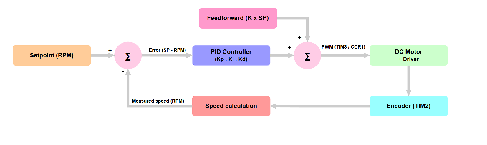
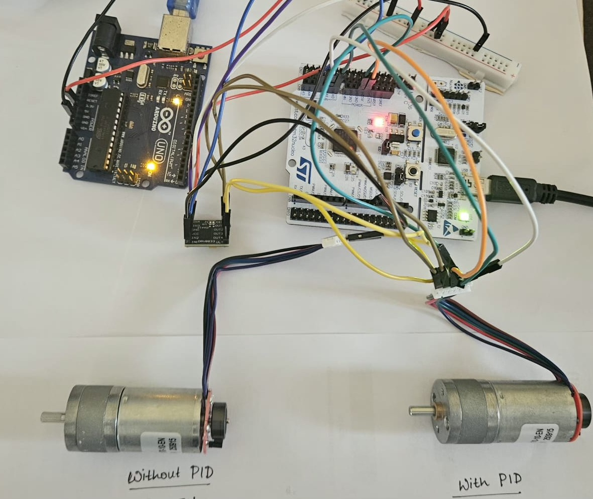
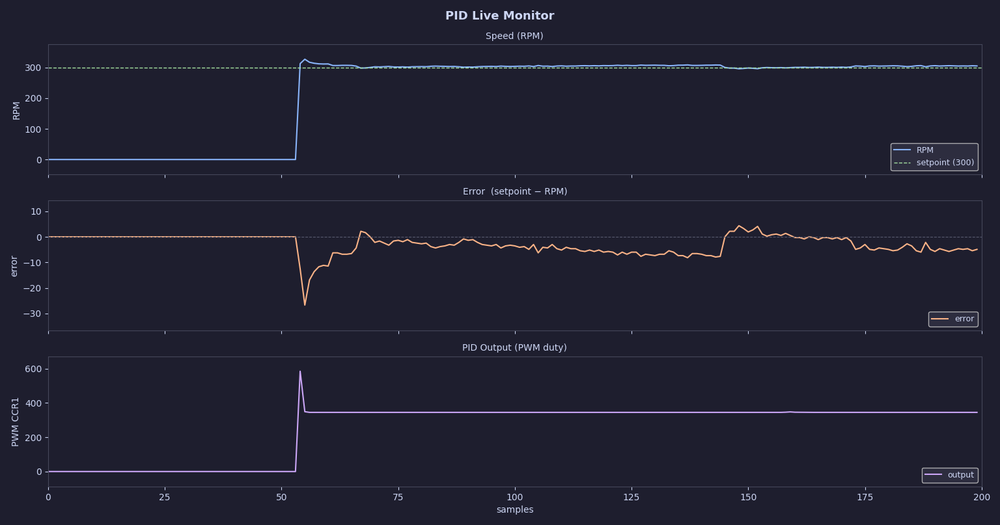
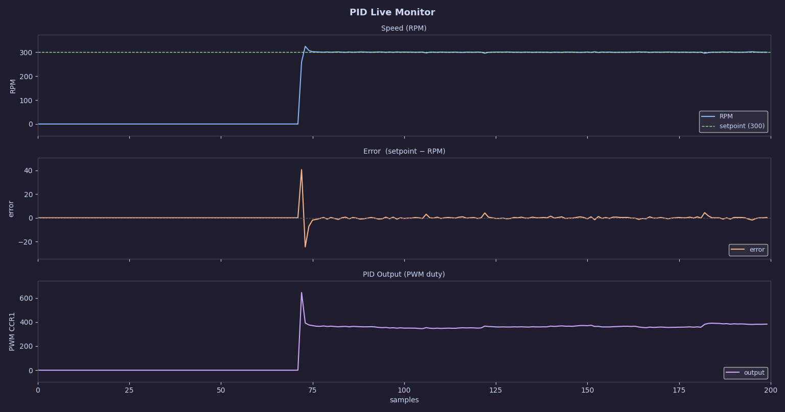
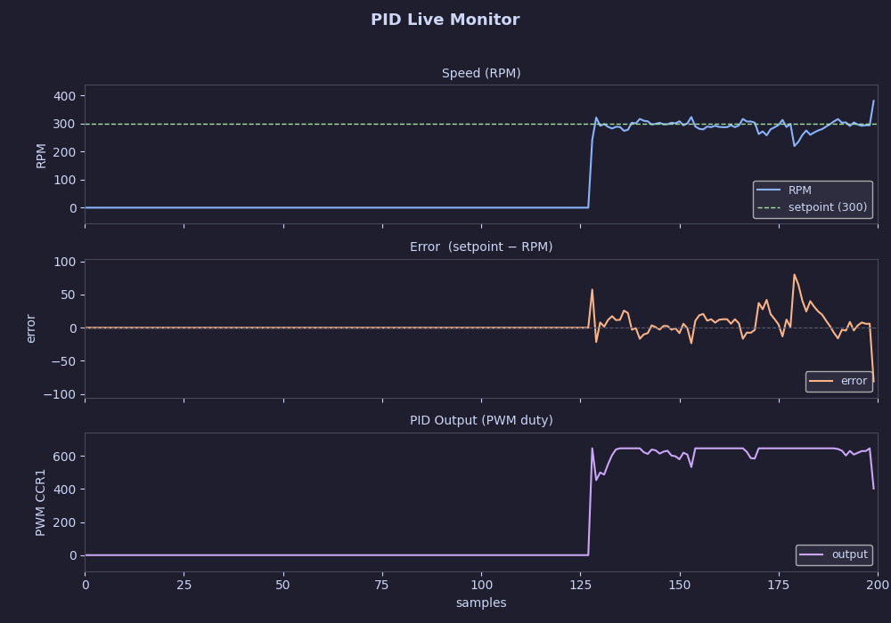

## PID-motor-control-using-STM32f401
Closed loop DC Motor speed control using PID on STM32 

## Core idea:
Measure motor speed using an encoder, compare it with a desired value, and adjust the PWM using a PID controller so the motor maintains that speed.

## What it does
* Uses TIM3 to generate PWM for motor control
* Uses TIM2 to read encoder signals
* Uses TIM4 interrupt to run the control loop
* Adjusts motor speed using a PID algorithm
* Start/stop using a button interrupt

## Block Diagram

  

## How it works

* Encoder feedback is used to estimate motor speed  
* Error = setpoint - measured speed
* PID controller processes the error
* Output is converted to PWM duty cycle
* Motor speed is continuously regulated to match the setpoint  

## Hardware used
* STM32F401RET6 - Nucleo board (Cortex M4)
* DRV8833 Motor Driver
* TT MOTOR GM25-370CA-22170-10-EN - DC 6V, 550RPM
* Power supply 5V (used 5V from an Arduino UNO)
* M-M and M-F jumper wires

## Setup

  

## Results
The controller maintains motor speed close to the setpoint under varying load conditions by adjusting the PWM output.
### Under no load:

  

### Under light load (RC car wheels):

  

### Under heavy load (RC car wheels on rough surface):

  

Speed drops initially under load, and the controller increases PWM to restore the setpoint.

## Notes
* CMSIS and DSP files are included inside the project
* Include paths need to be set in STM32CubeIDE (see chip_header/README.md)
* For live visualization, a Python script is provided in the `Test/` folder.  

---

## License

MIT
